# NPLAWI - Sistem Informasi Pemesanan Air Mineral Nestle Purelife

## 📌 Deskripsi Project
NPLAWI merupakan sistem informasi berbasis web yang dirancang untuk membantu proses manajemen pemesanan produk secara terstruktur mulai dari pemesanan oleh pelanggan hingga pengelolaan pesanan oleh admin.

Sistem ini dibuat untuk meningkatkan efisiensi pengelolaan pesanan, memantau status pesanan, serta memudahkan proses pencatatan transaksi secara digital.

Project ini dikembangkan sebagai bagian dari rancang bangun sistem informasi.

---

## 🎯 Tujuan Project
Tujuan dari pengembangan sistem ini adalah:

- Mempermudah proses pemesanan produk
- Mengelola data pesanan secara terstruktur
- Memantau status pesanan secara real-time
- Membantu admin dalam mengelola transaksi dan pesanan pelanggan

---

## ⚙️ Teknologi yang Digunakan

Backend
- Node.js
- Express.js

Frontend
- HTML
- CSS
- JavaScript

Database
- MySQL

Tools
- Git
- GitHub

---

## 👤 Role Pengguna

Sistem memiliki beberapa role pengguna:

### 1️⃣ User
Fitur yang tersedia:
- Melihat daftar produk
- Melakukan pemesanan produk
- Mengisi data pengiriman
- Melihat status pesanan

### 2️⃣ Admin
Fitur yang tersedia:
- Mengelola data produk
- Mengelola data pesanan
- Memproses pesanan
- Mengubah status pesanan
- Mencetak invoice pesanan

### 3️⃣ Kepala Cabang
Fitur yang tersedia:
- Monitoring pesanan dari seluruh toko
- Mengelola harga produk
- Mengelola stok produk
- Melihat laporan penjualan

### 4️⃣ Kurir
Fitur yang tersedia:
- Melihat daftar pengiriman
- Melihat detail pesanan yang harus dikirim
- Mengakses informasi pengiriman
---

## 🔄 Alur Sistem

1. User melihat produk yang tersedia
2. User melakukan pemesanan produk
3. Sistem menyimpan data pesanan ke database
4. Admin menerima pesanan berdasarkan metode FCFS (First Come First Served)
5. Admin memproses pesanan
6. Status pesanan diperbarui hingga selesai

---

## 🗄️ Struktur Database

Beberapa tabel utama yang digunakan:

- `orders`
- `order_items`
- `products`
- `order_status`

Relasi utama:
- `orders` terhubung dengan `order_items`
- `orders` terhubung dengan `order_status`
- `order_items` terhubung dengan `products`

---

## 📷 Tampilan Sistem

### 🏠 Homepage
Halaman awal sistem yang dapat diakses oleh pengguna sebelum melakukan login. Pengguna dapat melihat informasi produk dan melakukan autentikasi ke dalam sistem.

#### Halaman Home
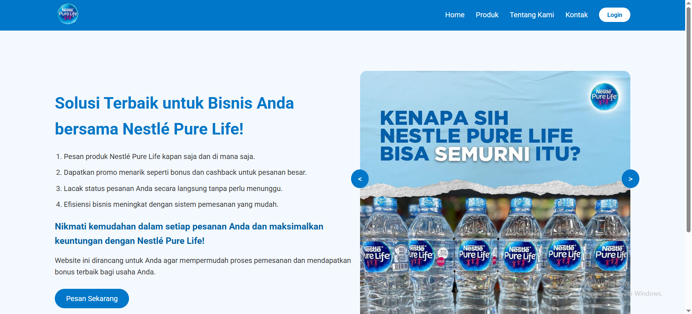

#### Halaman Login
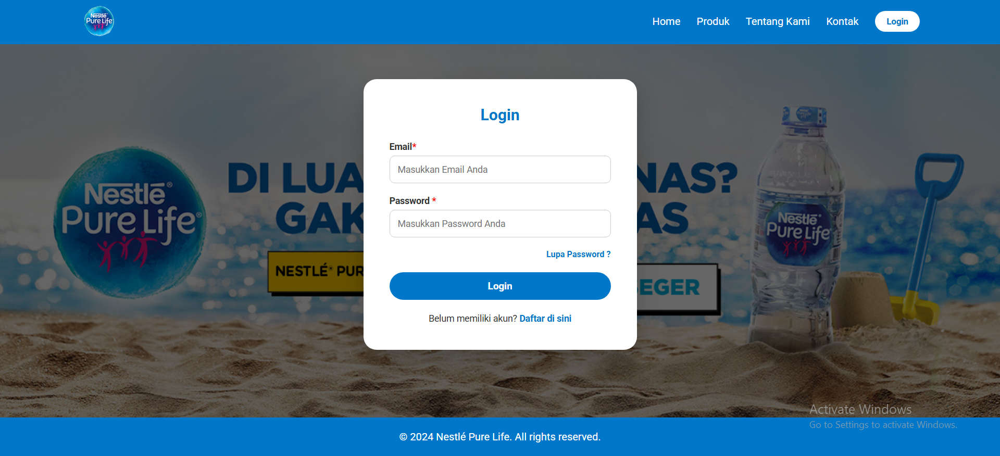

#### Halaman Produk
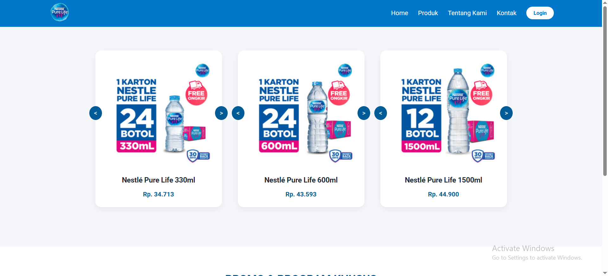

---

## 👤 Tampilan Pelanggan
Role pelanggan digunakan untuk melakukan pemesanan produk dan memantau status pesanan yang telah dibuat.

#### Dashboard Pelanggan
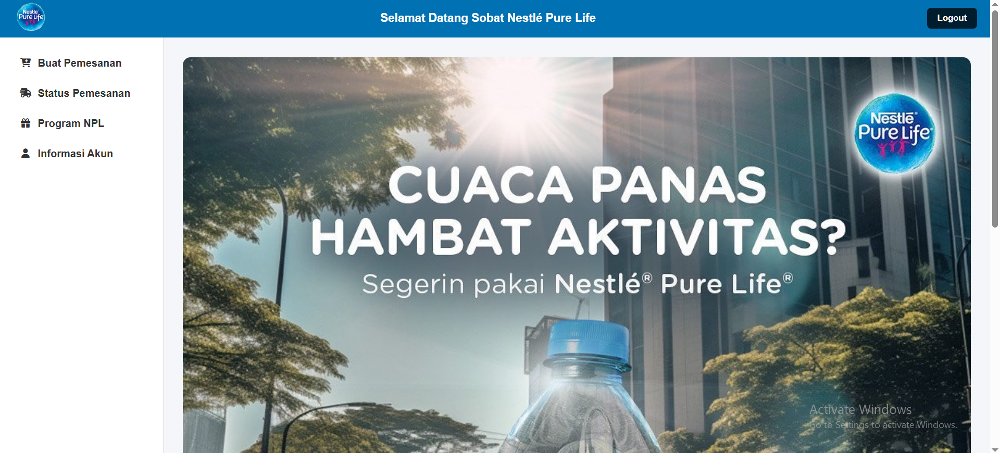

#### Halaman Pemesanan
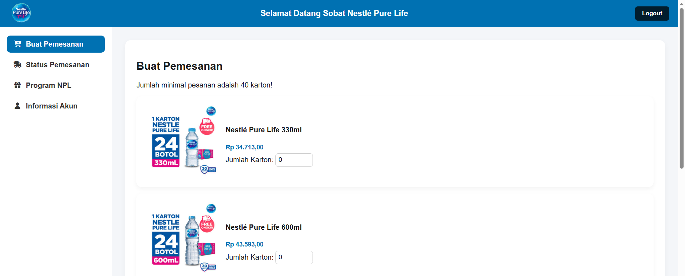

#### Detail Pesanan
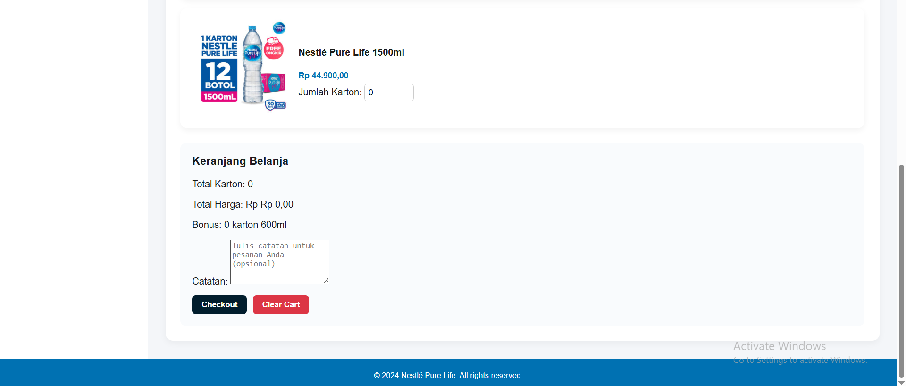

#### Status Pesanan
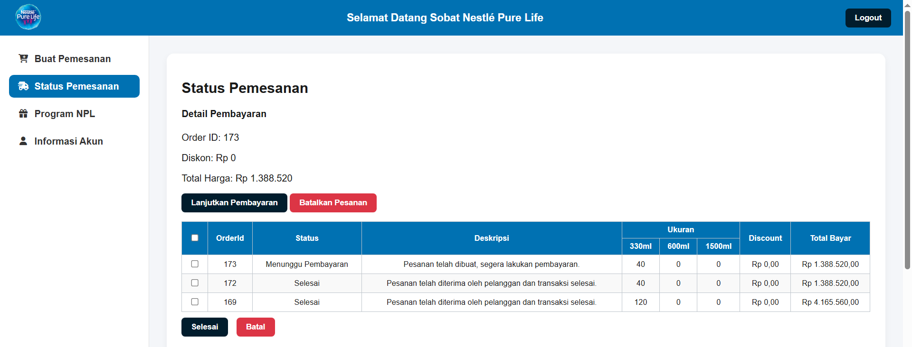

---

## 🛠 Tampilan Admin
Admin bertanggung jawab untuk mengelola data pesanan, memonitor program penjualan, serta melihat laporan transaksi.

#### Manajemen Pesanan
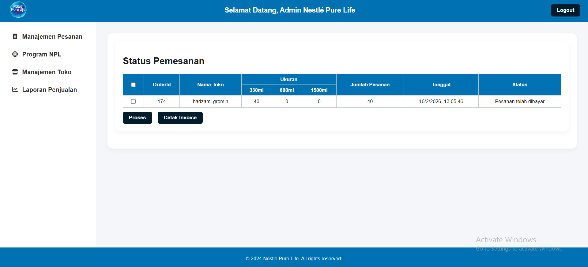

#### Monitoring Program
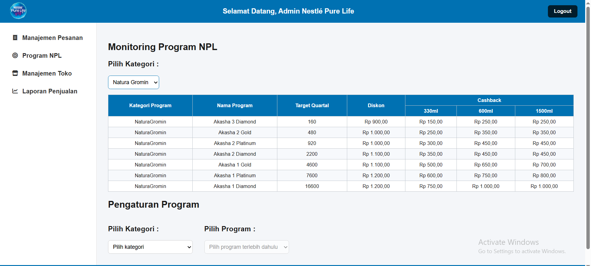

#### Manajemen Toko
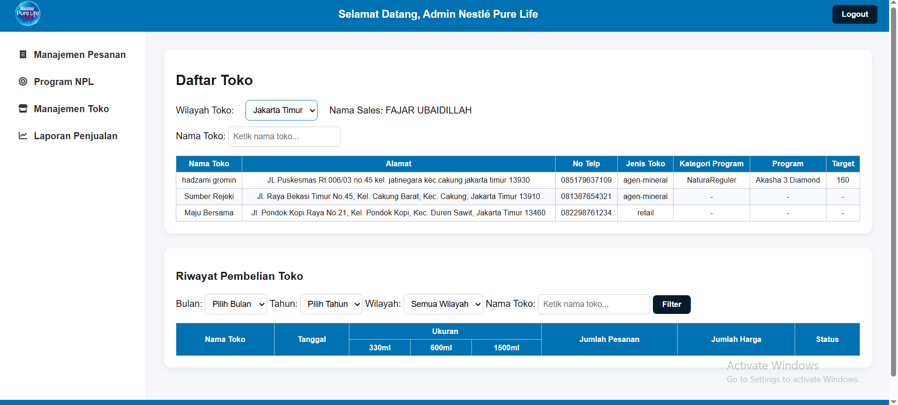

#### Laporan Penjualan
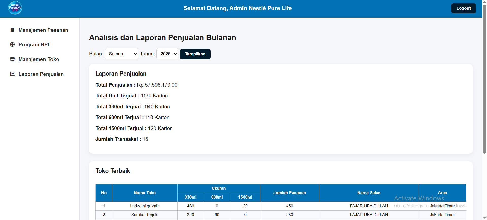

#### Cetak Invoice
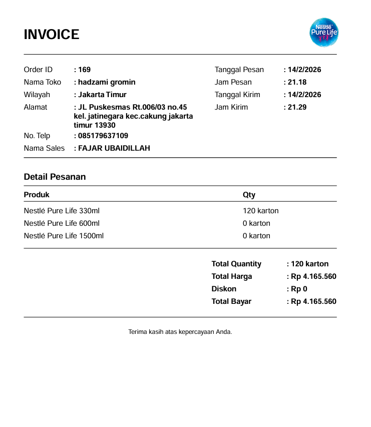

---

## 🏢 Tampilan Kepala Cabang
Kepala cabang memiliki akses untuk memantau operasional penjualan, mengatur harga produk, serta mengelola stok barang pada sistem.

#### Monitoring Pesanan
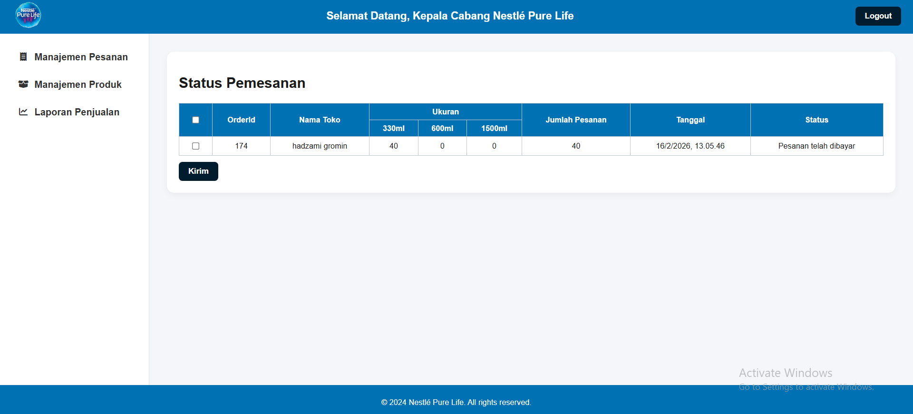

#### Manajemen Harga Produk
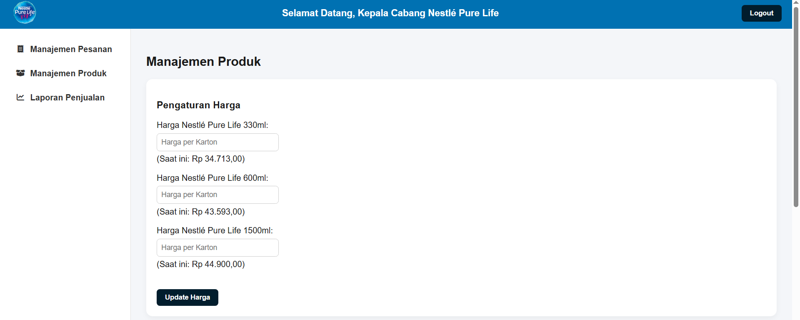

#### Manajemen Stok
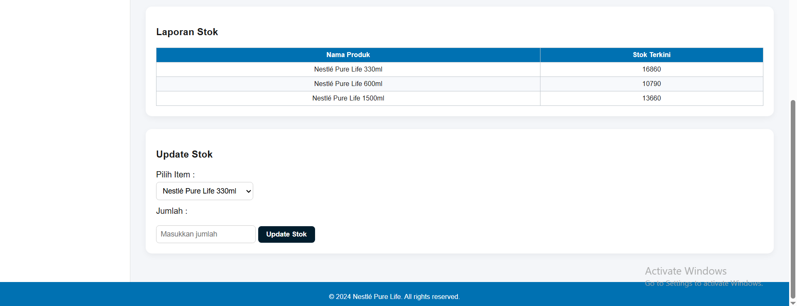

#### Laporan Penjualan
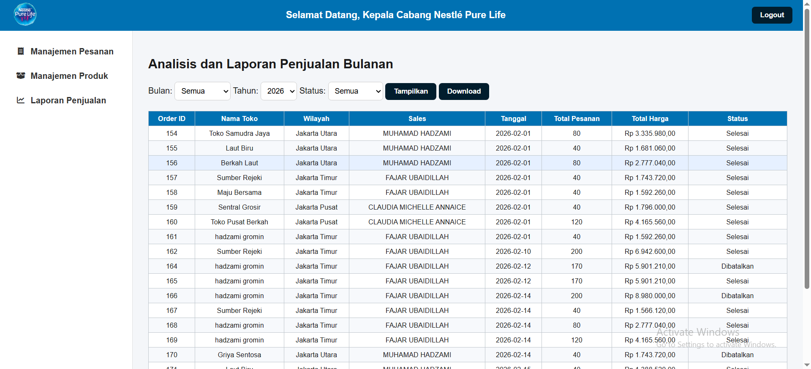

---

## 🚚 Tampilan Kurir
Kurir menggunakan sistem untuk melihat daftar pengiriman dan informasi pengantaran pesanan kepada pelanggan.

#### Daftar Pengiriman
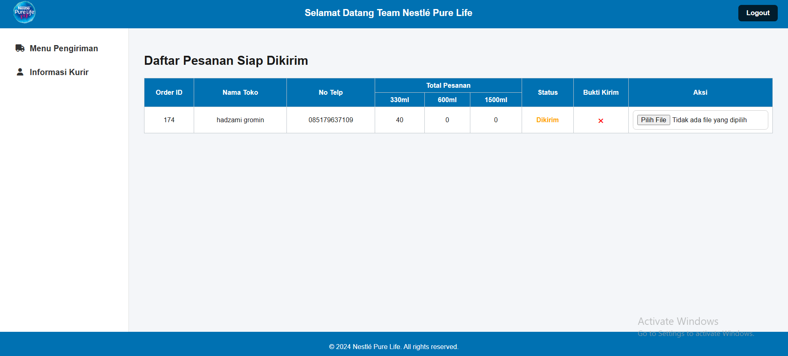

#### Informasi Kurir
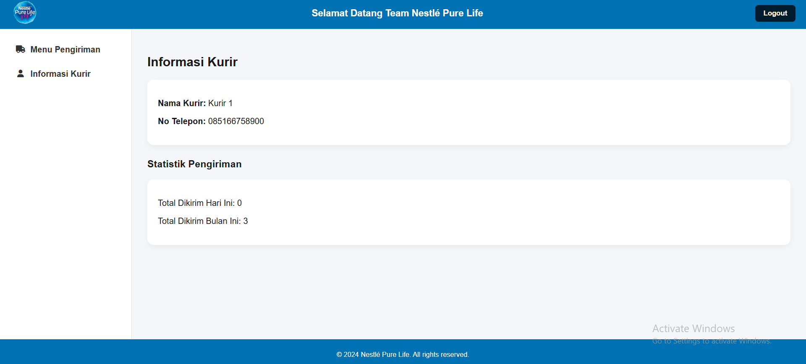
